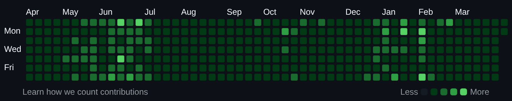

# github-planter

GitHubのActivity(↓の図のやつ)に草生やすやつ.

## Summary

* GitHubのActivityに草生やして見栄えを良くしたい
  * 自動で生やしたい
  * 草を生やす = いずれかのアクションを取る
    * コミットをする
    * コードレビューをする
    * Issueをつくる
    * Pull Requestをつくる
* GitHub Actionsの定期ジョブでコミットを1つ作成する
  * ~~1時間に1回実行~~
    * コスト削減のため、6時間ごとに起動
    * 1回の起動で6時間分=6回のコミットを作成する
  * 毎回新しいファイルを生成してもリポジトリが巨大になりすぎるだけなので、必要最低限の更新に限定する
